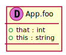
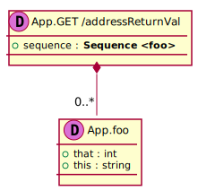

[Back](../README.md)
# Package App

## Index
| Service Name | Method |
| - | - | 
| App | [GET/address](#App-GET/address) |

Integration diagram:

---

## App

## App GET /address

### Sequence Diagram

### Request types

### Response types

---

