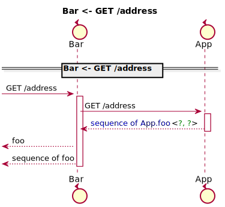
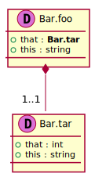
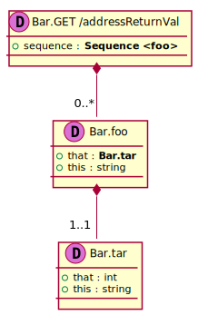

[Back](../README.md)
# Package Bar

## Index
| Service Name | Method |
| - | - | 
| Bar | [GET/address](#Bar-GET/address) |

Integration diagram:

---

## Bar

## Bar GET /address

### Sequence Diagram

### Request types

### Response types

---

