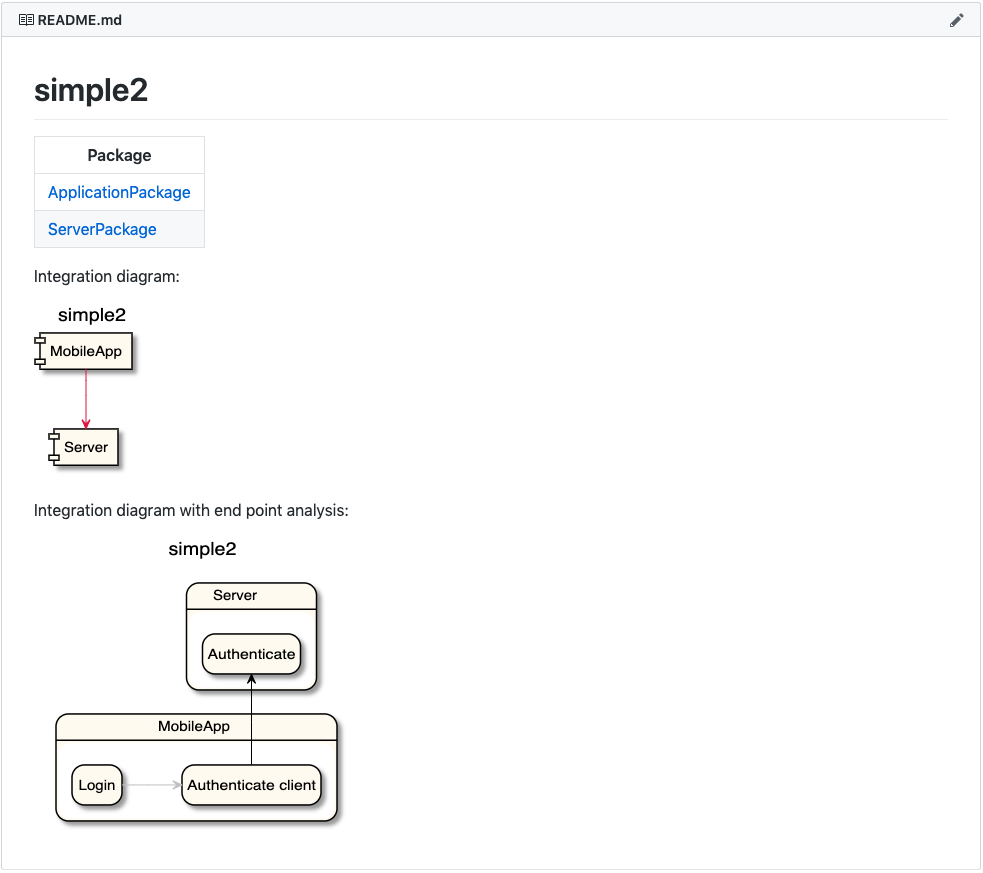
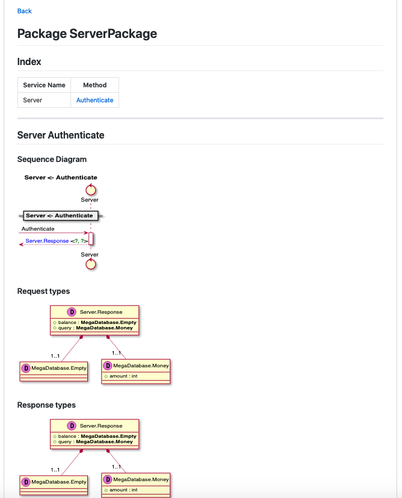

# syslcatalog

A markdown + Diagram generator for sysl specifications
## Installation

```bash
go get -u -v github.com/anz-bank/sysl-catalog
```

## How to use
1. Set up environment
`export SYSL_PLANTUML=http://www.plantuml.com/plantuml`

2. Run 

```bash
sysl-catalog -o <outputdir> <input.sysl>
```

3. That's it (basically!)

    This will generate markdown with integration diagrams + sequence diagrams + data model diagrams as seen in [demo/docs/README.md](demo/docs/README.md).

## Requirements
In [demo/docs/README.md](demo/docs/README.md) we have an example with a couple of interesting parts:

1. There needs to be a sysl `project` the same name as the filename:

so as this example is called "simple2.sysl" there needs to be a `project` "simple2":
- `application`s in our integration diagram:
```
simple2[appfmt="%(appname)", ~ignore]:
    _:
        MobileApp
        Server
        MegaDatabase
```
NOTE: must have `appfmt="%(appname)"` as an attribute to render integration diagrams correctly.

2. `@package` attribute must be specified:
 - This will create a markdown page for "ApplicationPackage" as seen in [demo/docs/ApplicationPackage/README.md](demo/docs/ApplicationPackage/README.md).
 Currently the package name is not inferred from the `application` name, so this needs to be added.
 ```
MobileApp:
    @package = "ApplicationPackage"
    Login(input <: Server.Request):
        Server <- Authenticate
        return ok <: MegaDatabase.Empty
 ```

3. `application` names need to be prefixed to parameter types, since defined parameters are under scope of `application`:
 ```diff
MobileApp:
    @package = "ApplicationPackage"
+    Login(input <: Server.Request):
-    Login(input <: Request):
        Server <- Authenticate
        return ok <: MegaDatabase.Empty

Server:
    !type Request:
        query <: string
 ```

4. Add `~ignore` to `application`s/`project`s that are to be ignored in the markdown creation
 ```diff
ThisAppShouldntShow[~ignore]:
    NotMySystem:
        ...
# Or ignore only specific endpoints
ThisAppShouldShow[~ignore]:
    NotMySystem[~ignore]:
        ...
 ```

## Screenshots

*project_view*


*package_view*
