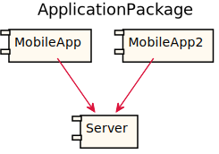
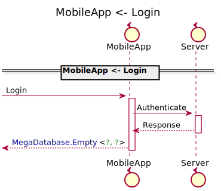
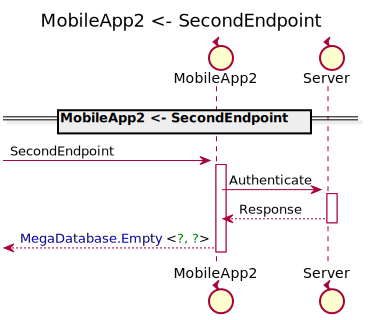
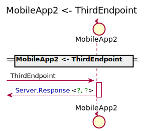

[Back](../README.md)
# Package ApplicationPackage

## Service Index
| Service Name | Method |
----|----
MobileApp | [Another](#MobileApp-Another) |
MobileApp | [Login](#MobileApp-Login) |
MobileApp2 | [SecondEndpoint](#MobileApp2-SecondEndpoint) |
MobileApp2 | [ThirdEndpoint](#MobileApp2-ThirdEndpoint) |

## Database Index
| Database Name |
----|

[Types](#Types)

## Integration diagram

---

## MobileApp
this is a comment for MobileApp

## MobileApp Another

hello, world

### Sequence Diagram

### Request types

### Response types

## MobileApp Login

hello, gamers

### Sequence Diagram

### Request types

### Response types

---

## MobileApp2
this is a comment for MobileApp

## MobileApp2 SecondEndpoint

SecondEndpoint, comment

### Sequence Diagram

### Request types

### Response types

## MobileApp2 ThirdEndpoint

ThirdEndpoint comment

### Sequence Diagram

### Request types

### Response types

---

## Types
<table>
<tr>
<th>App Name</th>
<th>Diagram</th>
<th>Comment</th>
<th>Full Link</th>
</tr>
<tr>

</table>
