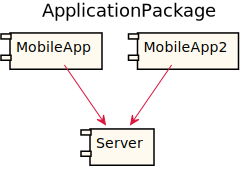
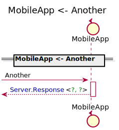
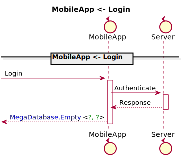
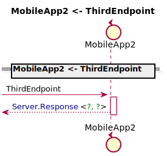

[Back](../README.md)

# ApplicationPackage

## Service Index
| Service Name | Method |
----|----
MobileApp | [Another](#MobileApp-Another)
MobileApp | [Login](#MobileApp-Login)
MobileApp2 | [SecondEndpoint](#MobileApp2-SecondEndpoint)
MobileApp2 | [ThirdEndpoint](#MobileApp2-ThirdEndpoint)

# MobileApp

this is a comment for MobileApp

## MobileApp Another
hello, world

### Request types

No Request types

### Response types

Response Response Response

## MobileApp Login
hello, gamers

### Request types

### Response types

Empty Empty Empty

# MobileApp2

this is a comment for MobileApp

## MobileApp2 SecondEndpoint
SecondEndpoint, comment

### Request types

### Response types

Empty Empty Empty

## MobileApp2 ThirdEndpoint
ThirdEndpoint comment

### Request types

No Request types

### Response types

Response Response Response

### Types

<table>
<tr>
<th>App Name</th>
<th>Diagram</th>
<th>Comment</th>
<th>Full Diagram</th>

</tr>

</tr>

</table>

