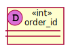
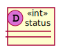
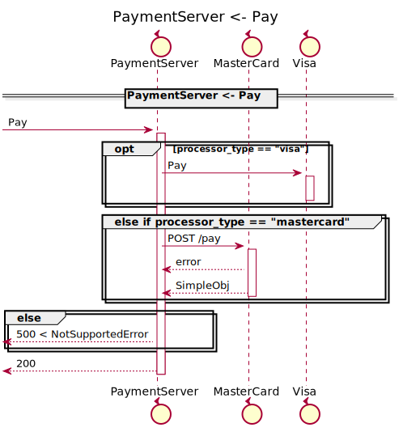
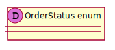

[Back](../README.md)

# BFF

## Integration Diagram

## Application Index

| Application Name | Method | Source Location |
|----|----|----|
| DeliveryServer | [...](#DeliveryServer-...) | [https://github.com/anz-bank/sysl-catalog/blob/master/demo/simple2.sysl](https://github.com/anz-bank/sysl-catalog/blob/master/demo/simple2.sysl)|  
| IdentityServer | [Authenticate](#IdentityServer-Authenticate) | [https://github.com/anz-bank/sysl-catalog/blob/master/demo/simple2.sysl](https://github.com/anz-bank/sysl-catalog/blob/master/demo/simple2.sysl)|  
| IdentityServer | [CustomerProfile](#IdentityServer-CustomerProfile) | [https://github.com/anz-bank/sysl-catalog/blob/master/demo/simple2.sysl](https://github.com/anz-bank/sysl-catalog/blob/master/demo/simple2.sysl)|  
| IdentityServer | [NewCustomer](#IdentityServer-NewCustomer) | [https://github.com/anz-bank/sysl-catalog/blob/master/demo/simple2.sysl](https://github.com/anz-bank/sysl-catalog/blob/master/demo/simple2.sysl)|  
| IdentityServer | [UpdatePassword](#IdentityServer-UpdatePassword) | [https://github.com/anz-bank/sysl-catalog/blob/master/demo/simple2.sysl](https://github.com/anz-bank/sysl-catalog/blob/master/demo/simple2.sysl)|  
| OrderServer | [Order](#OrderServer-Order) | [https://github.com/anz-bank/sysl-catalog/blob/master/demo/simple2.sysl](https://github.com/anz-bank/sysl-catalog/blob/master/demo/simple2.sysl)|  
| OrderServer | [Review](#OrderServer-Review) | [https://github.com/anz-bank/sysl-catalog/blob/master/demo/simple2.sysl](https://github.com/anz-bank/sysl-catalog/blob/master/demo/simple2.sysl)|  
| OrderServer | [UpdateOrderStatus](#OrderServer-UpdateOrderStatus) | [https://github.com/anz-bank/sysl-catalog/blob/master/demo/simple2.sysl](https://github.com/anz-bank/sysl-catalog/blob/master/demo/simple2.sysl)|  
| PaymentServer | [Pay](#PaymentServer-Pay) | [https://github.com/anz-bank/sysl-catalog/blob/master/demo/simple2.sysl](https://github.com/anz-bank/sysl-catalog/blob/master/demo/simple2.sysl)|  
| ProductServer | [Menu](#ProductServer-Menu) | [https://github.com/anz-bank/sysl-catalog/blob/master/demo/simple2.sysl](https://github.com/anz-bank/sysl-catalog/blob/master/demo/simple2.sysl)|  

## Type Index

| Application Name | Type Name | Source Location |
|----|----|----|
| IdentityServer | [Customer](#IdentityServer.Customer) | [https://github.com/anz-bank/sysl-catalog/blob/master/demo/simple2.sysl](https://github.com/anz-bank/sysl-catalog/blob/master/demo/simple2.sysl)|
| IdentityServer | [NewCustomerRequest](#IdentityServer.NewCustomerRequest) | [https://github.com/anz-bank/sysl-catalog/blob/master/demo/simple2.sysl](https://github.com/anz-bank/sysl-catalog/blob/master/demo/simple2.sysl)|
| IdentityServer | [UnauthorizedError](#IdentityServer.UnauthorizedError) | [https://github.com/anz-bank/sysl-catalog/blob/master/demo/simple2.sysl](https://github.com/anz-bank/sysl-catalog/blob/master/demo/simple2.sysl)|
| OrderServer | [Order](#OrderServer.Order) | [https://github.com/anz-bank/sysl-catalog/blob/master/demo/simple2.sysl](https://github.com/anz-bank/sysl-catalog/blob/master/demo/simple2.sysl)|
| OrderServer | [OrderProduct](#OrderServer.OrderProduct) | [https://github.com/anz-bank/sysl-catalog/blob/master/demo/simple2.sysl](https://github.com/anz-bank/sysl-catalog/blob/master/demo/simple2.sysl)|
| OrderServer | [OrderRequest](#OrderServer.OrderRequest) | [https://github.com/anz-bank/sysl-catalog/blob/master/demo/simple2.sysl](https://github.com/anz-bank/sysl-catalog/blob/master/demo/simple2.sysl)|
| OrderServer | [OrderStatus](#OrderServer.OrderStatus) | [https://github.com/anz-bank/sysl-catalog/blob/master/demo/simple2.sysl](https://github.com/anz-bank/sysl-catalog/blob/master/demo/simple2.sysl)|
| PaymentServer | [PaymentType](#PaymentServer.PaymentType) | [https://github.com/anz-bank/sysl-catalog/blob/master/demo/simple2.sysl](https://github.com/anz-bank/sysl-catalog/blob/master/demo/simple2.sysl)|
| ProductServer | [Product](#ProductServer.Product) | [https://github.com/anz-bank/sysl-catalog/blob/master/demo/simple2.sysl](https://github.com/anz-bank/sysl-catalog/blob/master/demo/simple2.sysl)|
| ProductServer | [Products](#ProductServer.Products) | [https://github.com/anz-bank/sysl-catalog/blob/master/demo/simple2.sysl](https://github.com/anz-bank/sysl-catalog/blob/master/demo/simple2.sysl)|

# Applications

## Application DeliveryServer

- We are going to provide delivery service ASAP
 since our customers need it during COVID-19

### DeliveryServer ...

Sequence Diagram

Request types

No Request types

Response types

No Response Types

---

## Application IdentityServer

- This server handles all the customer related endpoints
 including customer profile, password update, 
 customer authentication, etc.

### IdentityServer Authenticate
this is a description of Authenticate

Sequence Diagram

Request types

Response types

No Response Types

---

### IdentityServer CustomerProfile

Sequence Diagram

Request types

Response types

---

### IdentityServer NewCustomer

Sequence Diagram

Request types

Response types

---

### IdentityServer UpdatePassword

Sequence Diagram

Request types

Response types

No Response Types

---

## Application OrderServer

- This server handles all the order
 related endpoints.

### OrderServer Order

Sequence Diagram

Request types

Response types

No Response Types

---

### OrderServer Review

Sequence Diagram

Request types

Response types

---

### OrderServer UpdateOrderStatus

Sequence Diagram

Request types

Response types

---

## Application PaymentServer

- This server handles all the payment related endpoints.

### PaymentServer Pay

Sequence Diagram

Request types

No Request types

Response types

No Response Types

---

## Application ProductServer

- This server handles all the product
 related endpoints.

### ProductServer Menu

Sequence Diagram

Request types

No Request types

Response types

---

# Types

IdentityServer.Customer

### IdentityServer.Customer

- Empty Type

[Full Diagram](IdentityServer/customer.svg)

#### Fields

| Field name | Type | Description |
|----|----|----|
| email | string | |
| first_name | string | |
| last_name | string | |
| middle_name | string | |
| phone | string | |

IdentityServer.NewCustomerRequest

### IdentityServer.NewCustomerRequest

[Full Diagram](IdentityServer/newcustomerrequest.svg)

#### Fields

| Field name | Type | Description |
|----|----|----|
| email | string | |
| first_name | string | |
| last_name | string | |
| middle_name | string | |
| password | string | |
| phone | string | |

IdentityServer.UnauthorizedError

### IdentityServer.UnauthorizedError

[Full Diagram](IdentityServer/unauthorizederror.svg)

#### Fields

| Field name | Type | Description |
|----|----|----|
| error_msg | string | |

OrderServer.Order

### OrderServer.Order

- Customer order information

[Full Diagram](OrderServer/order.svg)

#### Fields

| Field name | Type | Description |
|----|----|----|
| id | int | |
| items | sequence of OrderProduct | |
| paid | bool | |
| review_comment | string | |
| review_score | int | |
| status | OrderStatus | |
| total_price | int | |

OrderServer.OrderProduct

### OrderServer.OrderProduct

- Order items

[Full Diagram](OrderServer/orderproduct.svg)

#### Fields

| Field name | Type | Description |
|----|----|----|
| comments | string | |
| product_id | int | |
| quantity | int | |

OrderServer.OrderRequest

### OrderServer.OrderRequest

[Full Diagram](OrderServer/orderrequest.svg)

#### Fields

| Field name | Type | Description |
|----|----|----|
| order_id | int | |
| product_id | int | |
| quantity | int | |

OrderServer.OrderStatus

### OrderServer.OrderStatus

[Full Diagram](OrderServer/orderstatus.svg)

PaymentServer.PaymentType

### PaymentServer.PaymentType

[Full Diagram](PaymentServer/paymenttype.svg)

ProductServer.Product

### ProductServer.Product

- Product information

[Full Diagram](ProductServer/product.svg)

#### Fields

| Field name | Type | Description |
|----|----|----|
| details | string | |
| id | int | |
| image | string | |
| name | string | |
| price | int | |

ProductServer.Products

### ProductServer.Products

[Full Diagram](ProductServer/products.svg)

