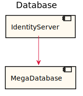
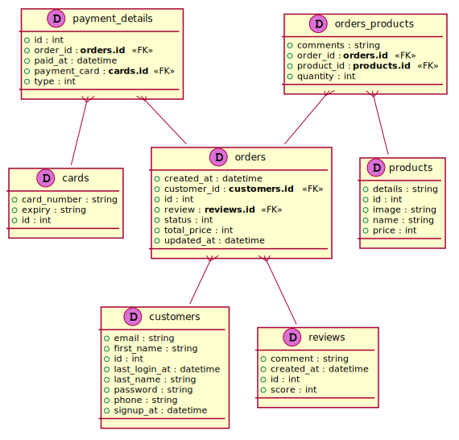

[Back](../README.md)

# Database

## Integration Diagram

## Database Index
| Database Application Name  | Source Location |
----|----
[MegaDatabase](#Database-MegaDatabase) | [https://github.com/anz-bank/sysl-catalog/blob/master/demo/sizzle.sysl](https://github.com/anz-bank/sysl-catalog/blob/master/demo/sizzle.sysl)|  

## Application Index

| Application Name | Method | Source Location |
|----|----|----|
| Cache | [...](#Cache-...) | [https://github.com/anz-bank/sysl-catalog/blob/master/demo/sizzle.sysl](https://github.com/anz-bank/sysl-catalog/blob/master/demo/sizzle.sysl)|  
| MegaDatabase | [InsertCustomer](#MegaDatabase-InsertCustomer) | [https://github.com/anz-bank/sysl-catalog/blob/master/demo/sizzle.sysl](https://github.com/anz-bank/sysl-catalog/blob/master/demo/sizzle.sysl)|  
| MegaDatabase | [SelectCustomer](#MegaDatabase-SelectCustomer) | [https://github.com/anz-bank/sysl-catalog/blob/master/demo/sizzle.sysl](https://github.com/anz-bank/sysl-catalog/blob/master/demo/sizzle.sysl)|  

## Type Index

No Types Defined

# Databases

Database MegaDatabase

# Applications

## Application Cache

### Cache ...

Sequence Diagram

Request types

No Request types

Response types

No Response Types

---

