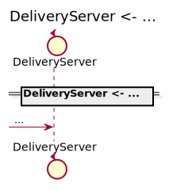

[Back](../README.md)

# DeliveryServer

## Integration Diagram

## Application Index

| Application Name | Method | Source Location |
|----|----|----|
| DeliveryServer | [...](#DeliveryServer-...) | [https://github.com/anz-bank/sysl-catalog/blob/master/demo/sizzle.sysl](https://github.com/anz-bank/sysl-catalog/blob/master/demo/sizzle.sysl)|  

## Type Index

No Types Defined

# Applications

## Application DeliveryServer

- We are going to provide delivery service ASAP
 since our customers need it during COVID-19

### DeliveryServer ...

Sequence Diagram

Request types

No Request types

Response types

No Response Types

---

