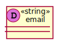
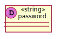
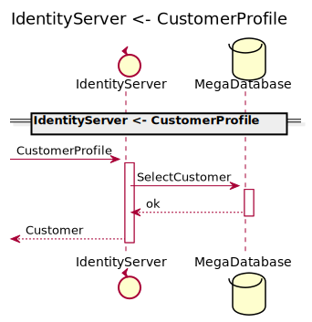
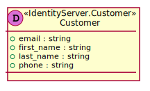
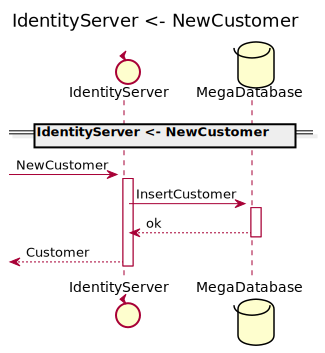
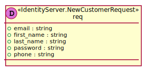
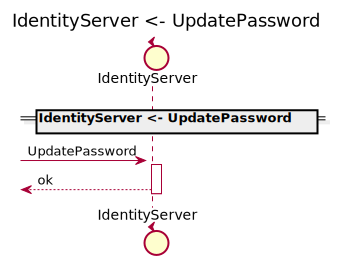
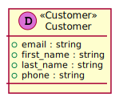

[Back](../README.md)

# IdentityServer

## Integration Diagram

## Application Index

| Application Name | Method | Source Location |
|----|----|----|
| IdentityServer | [Authenticate](#IdentityServer-Authenticate) | [https://github.com/anz-bank/sysl-catalog/blob/master/demo/sizzle.sysl](https://github.com/anz-bank/sysl-catalog/blob/master/demo/sizzle.sysl)|  
| IdentityServer | [CustomerProfile](#IdentityServer-CustomerProfile) | [https://github.com/anz-bank/sysl-catalog/blob/master/demo/sizzle.sysl](https://github.com/anz-bank/sysl-catalog/blob/master/demo/sizzle.sysl)|  
| IdentityServer | [NewCustomer](#IdentityServer-NewCustomer) | [https://github.com/anz-bank/sysl-catalog/blob/master/demo/sizzle.sysl](https://github.com/anz-bank/sysl-catalog/blob/master/demo/sizzle.sysl)|  
| IdentityServer | [UpdatePassword](#IdentityServer-UpdatePassword) | [https://github.com/anz-bank/sysl-catalog/blob/master/demo/sizzle.sysl](https://github.com/anz-bank/sysl-catalog/blob/master/demo/sizzle.sysl)|  

## Type Index

| Application Name | Type Name | Source Location |
|----|----|----|
| IdentityServer | [Customer](#IdentityServer.Customer) | [https://github.com/anz-bank/sysl-catalog/blob/master/demo/sizzle.sysl](https://github.com/anz-bank/sysl-catalog/blob/master/demo/sizzle.sysl)|
| IdentityServer | [NewCustomerRequest](#IdentityServer.NewCustomerRequest) | [https://github.com/anz-bank/sysl-catalog/blob/master/demo/sizzle.sysl](https://github.com/anz-bank/sysl-catalog/blob/master/demo/sizzle.sysl)|
| IdentityServer | [UnauthorizedError](#IdentityServer.UnauthorizedError) | [https://github.com/anz-bank/sysl-catalog/blob/master/demo/sizzle.sysl](https://github.com/anz-bank/sysl-catalog/blob/master/demo/sizzle.sysl)|

# Applications

## Application IdentityServer

- This server handles all the customer related endpoints
 including customer profile, password update, 
 customer authentication, etc.

### IdentityServer Authenticate
this is a description of Authenticate

Sequence Diagram

Request types

Response types

No Response Types

---

### IdentityServer CustomerProfile

Sequence Diagram

Request types

Response types

---

### IdentityServer NewCustomer

Sequence Diagram

Request types

Response types

---

### IdentityServer UpdatePassword

Sequence Diagram

Request types

Response types

No Response Types

---

# Types

IdentityServer.Customer

### IdentityServer.Customer

- This contains all information relating to a customer

[Full Diagram](IdentityServer/customer.svg)

#### Fields

| Field name | Type | Description |
|----|----|----|
| email | string | |
| first_name | string | |
| last_name | string | |
| phone | string | |

IdentityServer.NewCustomerRequest

### IdentityServer.NewCustomerRequest

[Full Diagram](IdentityServer/newcustomerrequest.svg)

#### Fields

| Field name | Type | Description |
|----|----|----|
| email | string | |
| first_name | string | |
| last_name | string | |
| password | string | |
| phone | string | |

IdentityServer.UnauthorizedError

### IdentityServer.UnauthorizedError

[Full Diagram](IdentityServer/unauthorizederror.svg)

#### Fields

| Field name | Type | Description |
|----|----|----|
| error_msg | string | |

