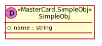
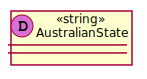
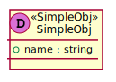

[Back](../README.md)

# MasterCard

## Integration Diagram

## Application Index

| Application Name | Method | Source Location |
|----|----|----|
| MasterCard | [POST /pay](#MasterCard-POSTpay) | [https://github.com/anz-bank/sysl-catalog/blob/master/demo/simple.yaml](https://github.com/anz-bank/sysl-catalog/blob/master/demo/simple.yaml)|  

## Type Index

| Application Name | Type Name | Source Location |
|----|----|----|
| MasterCard | [AustralianState](#MasterCard.AustralianState) | [https://github.com/anz-bank/sysl-catalog/blob/master/demo/simple.yaml](https://github.com/anz-bank/sysl-catalog/blob/master/demo/simple.yaml)|
| MasterCard | [SimpleObj](#MasterCard.SimpleObj) | [https://github.com/anz-bank/sysl-catalog/blob/master/demo/simple.yaml](https://github.com/anz-bank/sysl-catalog/blob/master/demo/simple.yaml)|
| MasterCard | [SimpleObj2](#MasterCard.SimpleObj2) | [https://github.com/anz-bank/sysl-catalog/blob/master/demo/simple.yaml](https://github.com/anz-bank/sysl-catalog/blob/master/demo/simple.yaml)|

# Applications

## Application MasterCard

- No description.

### MasterCard POST /pay

Sequence Diagram

Request types

No Request types

Response types

---

# Types

MasterCard.AustralianState

### MasterCard.AustralianState

[Full Diagram](MasterCard/australianstate.svg)

MasterCard.SimpleObj

### MasterCard.SimpleObj

[Full Diagram](MasterCard/simpleobj.svg)

#### Fields

| Field name | Type | Description |
|----|----|----|
| name | string | |

MasterCard.SimpleObj2

### MasterCard.SimpleObj2

[Full Diagram](MasterCard/simpleobj2.svg)

#### Fields

| Field name | Type | Description |
|----|----|----|
| name | SimpleObj | |

