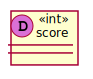
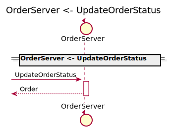
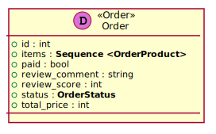

[Back](../README.md)

# OrderServer

## Integration Diagram

## Application Index

| Application Name | Method | Source Location |
|----|----|----|
| OrderServer | [Order](#OrderServer-Order) | [https://github.com/anz-bank/sysl-catalog/blob/master/demo/sizzle.sysl](https://github.com/anz-bank/sysl-catalog/blob/master/demo/sizzle.sysl)|  
| OrderServer | [Review](#OrderServer-Review) | [https://github.com/anz-bank/sysl-catalog/blob/master/demo/sizzle.sysl](https://github.com/anz-bank/sysl-catalog/blob/master/demo/sizzle.sysl)|  
| OrderServer | [UpdateOrderStatus](#OrderServer-UpdateOrderStatus) | [https://github.com/anz-bank/sysl-catalog/blob/master/demo/sizzle.sysl](https://github.com/anz-bank/sysl-catalog/blob/master/demo/sizzle.sysl)|  

## Type Index

| Application Name | Type Name | Source Location |
|----|----|----|
| OrderServer | [Order](#OrderServer.Order) | [https://github.com/anz-bank/sysl-catalog/blob/master/demo/sizzle.sysl](https://github.com/anz-bank/sysl-catalog/blob/master/demo/sizzle.sysl)|
| OrderServer | [OrderProduct](#OrderServer.OrderProduct) | [https://github.com/anz-bank/sysl-catalog/blob/master/demo/sizzle.sysl](https://github.com/anz-bank/sysl-catalog/blob/master/demo/sizzle.sysl)|
| OrderServer | [OrderRequest](#OrderServer.OrderRequest) | [https://github.com/anz-bank/sysl-catalog/blob/master/demo/sizzle.sysl](https://github.com/anz-bank/sysl-catalog/blob/master/demo/sizzle.sysl)|
| OrderServer | [OrderStatus](#OrderServer.OrderStatus) | [https://github.com/anz-bank/sysl-catalog/blob/master/demo/sizzle.sysl](https://github.com/anz-bank/sysl-catalog/blob/master/demo/sizzle.sysl)|

# Applications

## Application OrderServer

- This server handles all the order
 related endpoints.

### OrderServer Order

Sequence Diagram

Request types

Response types

No Response Types

---

### OrderServer Review

Sequence Diagram

Request types

Response types

---

### OrderServer UpdateOrderStatus

Sequence Diagram

Request types

Response types

---

# Types

OrderServer.Order

### OrderServer.Order

- Customer order information

[Full Diagram](OrderServer/order.svg)

#### Fields

| Field name | Type | Description |
|----|----|----|
| id | int | |
| items | sequence of OrderProduct | |
| paid | bool | |
| review_comment | string | |
| review_score | int | |
| status | OrderStatus | |
| total_price | int | |

OrderServer.OrderProduct

### OrderServer.OrderProduct

- Order items

[Full Diagram](OrderServer/orderproduct.svg)

#### Fields

| Field name | Type | Description |
|----|----|----|
| comments | string | |
| product_id | int | |
| quantity | int | |

OrderServer.OrderRequest

### OrderServer.OrderRequest

[Full Diagram](OrderServer/orderrequest.svg)

#### Fields

| Field name | Type | Description |
|----|----|----|
| order_id | int | |
| product_id | int | |
| quantity | int | |

OrderServer.OrderStatus

### OrderServer.OrderStatus

[Full Diagram](OrderServer/orderstatus.svg)

