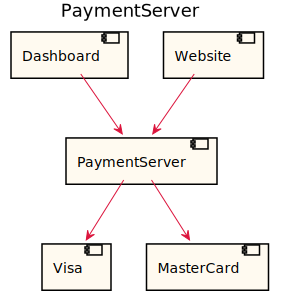

[Back](../README.md)

# PaymentServer

## Integration Diagram

## Application Index

| Application Name | Method | Source Location |
|----|----|----|
| PaymentServer | [Pay](#PaymentServer-Pay) | [https://github.com/anz-bank/sysl-catalog/blob/master/demo/sizzle.sysl](https://github.com/anz-bank/sysl-catalog/blob/master/demo/sizzle.sysl)|  

## Type Index

| Application Name | Type Name | Source Location |
|----|----|----|
| PaymentServer | [PaymentType](#PaymentServer.PaymentType) | [https://github.com/anz-bank/sysl-catalog/blob/master/demo/sizzle.sysl](https://github.com/anz-bank/sysl-catalog/blob/master/demo/sizzle.sysl)|

# Applications

## Application PaymentServer

- This server handles all the payment related endpoints.

### PaymentServer Pay

Sequence Diagram

Request types

No Request types

Response types

No Response Types

---

# Types

PaymentServer.PaymentType

### PaymentServer.PaymentType

[Full Diagram](PaymentServer/paymenttype.svg)

