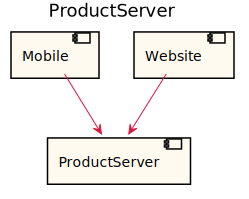
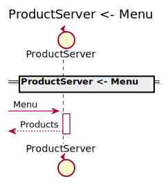
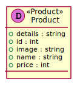

[Back](../README.md)

# ProductServer

## Integration Diagram

## Application Index

| Application Name | Method | Source Location |
|----|----|----|
| ProductServer | [Menu](#ProductServer-Menu) | [https://github.com/anz-bank/sysl-catalog/blob/master/demo/sizzle.sysl](https://github.com/anz-bank/sysl-catalog/blob/master/demo/sizzle.sysl)|  

## Type Index

| Application Name | Type Name | Source Location |
|----|----|----|
| ProductServer | [Product](#ProductServer.Product) | [https://github.com/anz-bank/sysl-catalog/blob/master/demo/sizzle.sysl](https://github.com/anz-bank/sysl-catalog/blob/master/demo/sizzle.sysl)|
| ProductServer | [Products](#ProductServer.Products) | [https://github.com/anz-bank/sysl-catalog/blob/master/demo/sizzle.sysl](https://github.com/anz-bank/sysl-catalog/blob/master/demo/sizzle.sysl)|

# Applications

## Application ProductServer

- This server handles all the product
 related endpoints.

### ProductServer Menu

Sequence Diagram

Request types

No Request types

Response types

---

# Types

ProductServer.Product

### ProductServer.Product

- Product information

[Full Diagram](ProductServer/product.svg)

#### Fields

| Field name | Type | Description |
|----|----|----|
| details | string | |
| id | int | |
| image | string | |
| name | string | |
| price | int | |

ProductServer.Products

### ProductServer.Products

[Full Diagram](ProductServer/products.svg)

