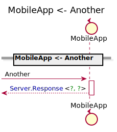
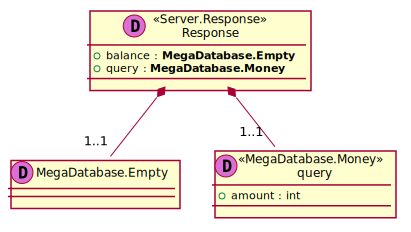
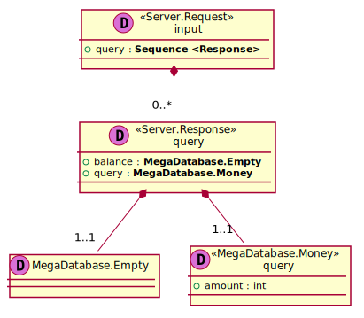
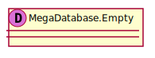
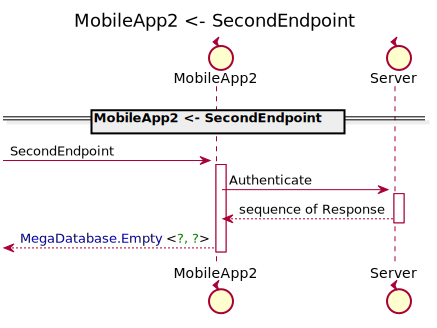

[Back](../README.md) | [Chat with us](https://anzoss.slack.com/messages/sysl-catalog/) | [New bug or feature request](https://github.com/anz-bank/sysl-catalog/issues/new)

# ApplicationPackage

## Integration Diagram

## Application Index

| Application Name | Method | Source Location |
|----|----|----|
| MobileApp | [Another](#MobileApp-Another) | [https://github.com/anz-bank/sysl-catalog/blob/master/demo/simple2.sysl](https://github.com/anz-bank/sysl-catalog/blob/master/demo/simple2.sysl)|  
| MobileApp | [Login](#MobileApp-Login) | [https://github.com/anz-bank/sysl-catalog/blob/master/demo/simple2.sysl](https://github.com/anz-bank/sysl-catalog/blob/master/demo/simple2.sysl)|  
| MobileApp2 | [SecondEndpoint](#MobileApp2-SecondEndpoint) | [https://github.com/anz-bank/sysl-catalog/blob/master/demo/simple2.sysl](https://github.com/anz-bank/sysl-catalog/blob/master/demo/simple2.sysl)|  
| MobileApp2 | [ThirdEndpoint](#MobileApp2-ThirdEndpoint) | [https://github.com/anz-bank/sysl-catalog/blob/master/demo/simple2.sysl](https://github.com/anz-bank/sysl-catalog/blob/master/demo/simple2.sysl)|  

## Type Index

No Types Defined

# Applications

## Application MobileApp

- this is a comment for MobileApp

### MobileApp Another
hello, world

Sequence Diagram

Request types

No Request types

Response types

Response Response Response

---

### MobileApp Login
hello, gamers

Sequence Diagram

Request types

Response types

Empty Empty Empty

---

## Application MobileApp2

- this is a comment for MobileApp

### MobileApp2 SecondEndpoint
SecondEndpoint, comment

Sequence Diagram

Request types

Response types

Empty Empty Empty

---

### MobileApp2 ThirdEndpoint
ThirdEndpoint comment

Sequence Diagram

Request types

No Request types

Response types

Response Response Response

---

