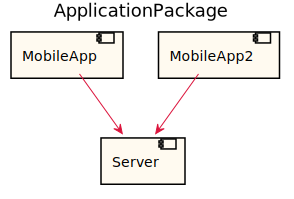
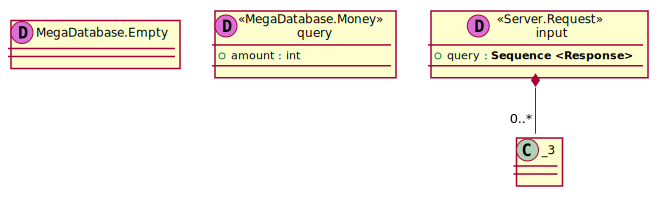

[Back](../README.md)

# ApplicationPackage

## Integration Diagram

## Database Index
| Database Application Name  | Source Location |
----|----

## Application Index
| Application Name | Method | Source Location |
----|----|----
MobileApp | [Another](#MobileApp-Another) | [../../../../demo/simple2.sysl](../../../../demo/simple2.sysl)|  
MobileApp | [Login](#MobileApp-Login) | [../../../../demo/simple2.sysl](../../../../demo/simple2.sysl)|  
MobileApp2 | [SecondEndpoint](#MobileApp2-SecondEndpoint) | [../../../../demo/simple2.sysl](../../../../demo/simple2.sysl)|  
MobileApp2 | [ThirdEndpoint](#MobileApp2-ThirdEndpoint) | [../../../../demo/simple2.sysl](../../../../demo/simple2.sysl)|  

## Type Index
| Application Name | Type Name | Source Location |
----|----|----

# Databases

# Applications

## Application MobileApp

- this is a comment for MobileApp

### MobileApp Another
hello, world

Sequence Diagram

Request types

#### Request types

No Request types

Response types

#### Response types

Response Response Response

---

### MobileApp Login
hello, gamers

Sequence Diagram

Request types

#### Request types

Response types

#### Response types

Empty Empty Empty

---

## Application MobileApp2

- this is a comment for MobileApp

### MobileApp2 SecondEndpoint
SecondEndpoint, comment

Sequence Diagram

Request types

#### Request types

Response types

#### Response types

Empty Empty Empty

---

### MobileApp2 ThirdEndpoint
ThirdEndpoint comment

Sequence Diagram

Request types

#### Request types

No Request types

Response types

#### Response types

Response Response Response

---

# Types

