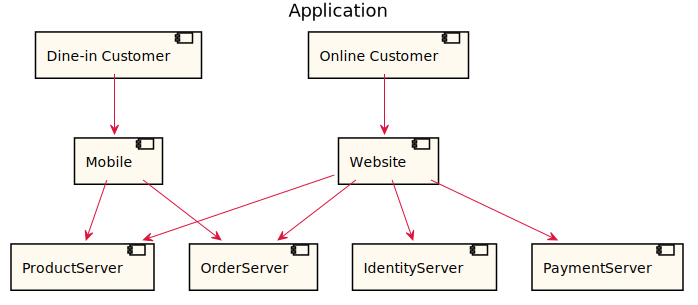
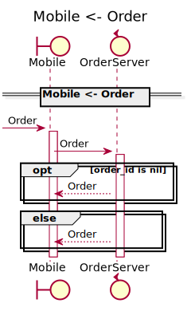
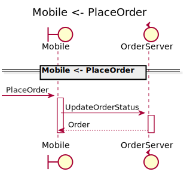
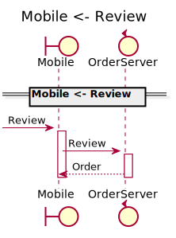
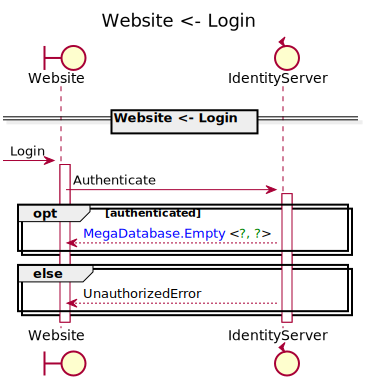
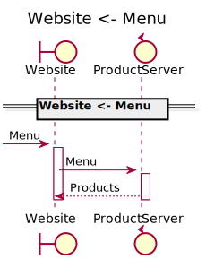
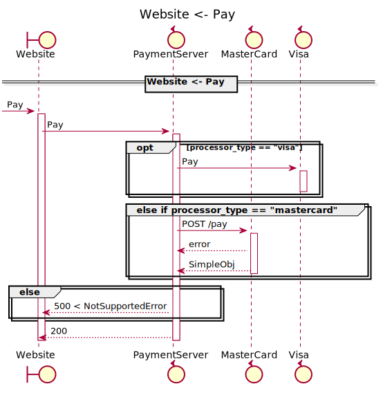
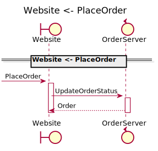
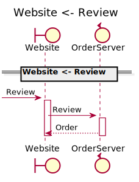
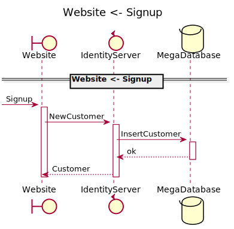

[Back](../README.md)

# Application

## Integration Diagram

## Application Index

| Application Name | Method | Source Location |
|----|----|----|
| Mobile | [Menu](#Mobile-Menu) | [https://github.com/anz-bank/sysl-catalog/blob/master/demo/sizzle.sysl](https://github.com/anz-bank/sysl-catalog/blob/master/demo/sizzle.sysl)|  
| Mobile | [Order](#Mobile-Order) | [https://github.com/anz-bank/sysl-catalog/blob/master/demo/sizzle.sysl](https://github.com/anz-bank/sysl-catalog/blob/master/demo/sizzle.sysl)|  
| Mobile | [PlaceOrder](#Mobile-PlaceOrder) | [https://github.com/anz-bank/sysl-catalog/blob/master/demo/sizzle.sysl](https://github.com/anz-bank/sysl-catalog/blob/master/demo/sizzle.sysl)|  
| Mobile | [Review](#Mobile-Review) | [https://github.com/anz-bank/sysl-catalog/blob/master/demo/sizzle.sysl](https://github.com/anz-bank/sysl-catalog/blob/master/demo/sizzle.sysl)|  
| Website | [ChangePassword](#Website-ChangePassword) | [https://github.com/anz-bank/sysl-catalog/blob/master/demo/sizzle.sysl](https://github.com/anz-bank/sysl-catalog/blob/master/demo/sizzle.sysl)|  
| Website | [Login](#Website-Login) | [https://github.com/anz-bank/sysl-catalog/blob/master/demo/sizzle.sysl](https://github.com/anz-bank/sysl-catalog/blob/master/demo/sizzle.sysl)|  
| Website | [Menu](#Website-Menu) | [https://github.com/anz-bank/sysl-catalog/blob/master/demo/sizzle.sysl](https://github.com/anz-bank/sysl-catalog/blob/master/demo/sizzle.sysl)|  
| Website | [Order](#Website-Order) | [https://github.com/anz-bank/sysl-catalog/blob/master/demo/sizzle.sysl](https://github.com/anz-bank/sysl-catalog/blob/master/demo/sizzle.sysl)|  
| Website | [Pay](#Website-Pay) | [https://github.com/anz-bank/sysl-catalog/blob/master/demo/sizzle.sysl](https://github.com/anz-bank/sysl-catalog/blob/master/demo/sizzle.sysl)|  
| Website | [PlaceOrder](#Website-PlaceOrder) | [https://github.com/anz-bank/sysl-catalog/blob/master/demo/sizzle.sysl](https://github.com/anz-bank/sysl-catalog/blob/master/demo/sizzle.sysl)|  
| Website | [Profile](#Website-Profile) | [https://github.com/anz-bank/sysl-catalog/blob/master/demo/sizzle.sysl](https://github.com/anz-bank/sysl-catalog/blob/master/demo/sizzle.sysl)|  
| Website | [Review](#Website-Review) | [https://github.com/anz-bank/sysl-catalog/blob/master/demo/sizzle.sysl](https://github.com/anz-bank/sysl-catalog/blob/master/demo/sizzle.sysl)|  
| Website | [Signup](#Website-Signup) | [https://github.com/anz-bank/sysl-catalog/blob/master/demo/sizzle.sysl](https://github.com/anz-bank/sysl-catalog/blob/master/demo/sizzle.sysl)|  

## Type Index

No Types Defined

# Applications

## Application Mobile

- Android and iOS App for Sizzle

### Mobile Menu

Sequence Diagram

Request types

No Request types

Response types

No Response Types

---

### Mobile Order

Sequence Diagram

Request types

No Request types

Response types

No Response Types

---

### Mobile PlaceOrder

Sequence Diagram

Request types

No Request types

Response types

No Response Types

---

### Mobile Review

Sequence Diagram

Request types

No Request types

Response types

No Response Types

---

## Application Website

- Web App for Sizzle

### Website ChangePassword

Sequence Diagram

Request types

Response types

No Response Types

---

### Website Login
For customer to login

Sequence Diagram

Request types

Response types

No Response Types

---

### Website Menu

Sequence Diagram

Request types

No Request types

Response types

No Response Types

---

### Website Order

Sequence Diagram

Request types

No Request types

Response types

No Response Types

---

### Website Pay

Sequence Diagram

Request types

No Request types

Response types

No Response Types

---

### Website PlaceOrder

Sequence Diagram

Request types

No Request types

Response types

No Response Types

---

### Website Profile

Sequence Diagram

Request types

Response types

No Response Types

---

### Website Review

Sequence Diagram

Request types

No Request types

Response types

No Response Types

---

### Website Signup

Sequence Diagram

Request types

Response types

No Response Types

---

