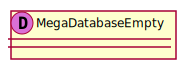

[Back](../README.md)

# MegaDatabase

## Service Index
| Service Name | Method |
----|----

### Types

<table>
<tr>
<th>App Name</th>
<th>Diagram</th>
<th>Attribute</th>
<th>Full Diagram</th>

</tr>

<tr>
<td>

MegaDatabase. Empty
</td>
<td>

</td>
<td> 

Attribute
 Empty Empty Empty
 
</td>
<td>

<a href="MegaDatabase/Empty.svg">Link</a>
</td>
</tr>
<tr>
<td>

MegaDatabase. Money
</td>
<td>

</td>
<td> 

Attribute
 Money Money Money
 
</td>
<td>

<a href="MegaDatabase/Money.svg">Link</a>
</td>
</tr>
</table>

