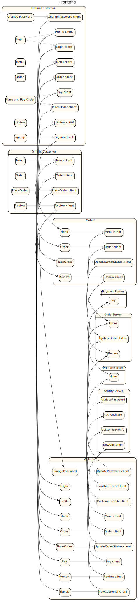

# simple2.sysl

| Package |
----|
[ApplicationPackage](ApplicationPackage/README.md)|
[MegaDatabase](MegaDatabase/README.md)|
[ServerPackage](ServerPackage/README.md)|
[foo](foo/README.md)|
[simpleredoc](simpleredoc/README.md)|
[that](that/README.md)|

## Integration Diagram

## End Point Analysis Integration Diagram

