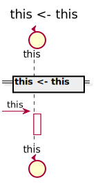

[Back](../README.md)

# MegaDatabase

## Service Index
| Service Name | Method |
----|----
this | [this](#this-this)

# this

## this this

### Request types

No Request types

### Response types

No Response Types

### Types

<table>
<tr>
<th>App Name</th>
<th>Diagram</th>
<th>Description</th>
<th>Full Diagram</th>

</tr>

</table>

