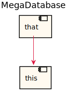
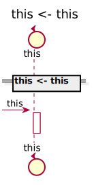
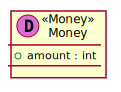

[Back](../README.md)

# MegaDatabase

## Service Index
| Service Name | Method | Source Location |
----|----|----
this | [this](#this-this) | [../../../../demo/simple2.sysl](../../../../demo/simple2.sysl)|  

# this

## this this

### Request types

No Request types

### Response types

No Response Types

### Types

<table>
<tr>
<th>App Name</th>
<th>Diagram</th>
<th>Description</th>
<th>Full Diagram</th>

</tr>

<tr>
<td>

MegaDatabase. Empty
</td>
<td>

</td>
<td> 

Description
 Empty Empty Empty
 
</td>
<td>

<a href="MegaDatabase/empty.svg">Link</a>
</td>
</tr>
<tr>
<td>

MegaDatabase. Money
</td>
<td>

</td>
<td> 

Description
 Money Money Money
 
</td>
<td>

<a href="MegaDatabase/money.svg">Link</a>
</td>
</tr>

</tr>

</table>

