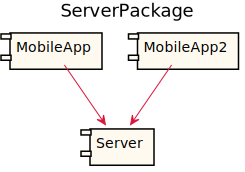
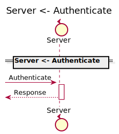
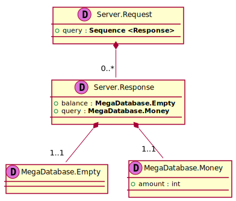
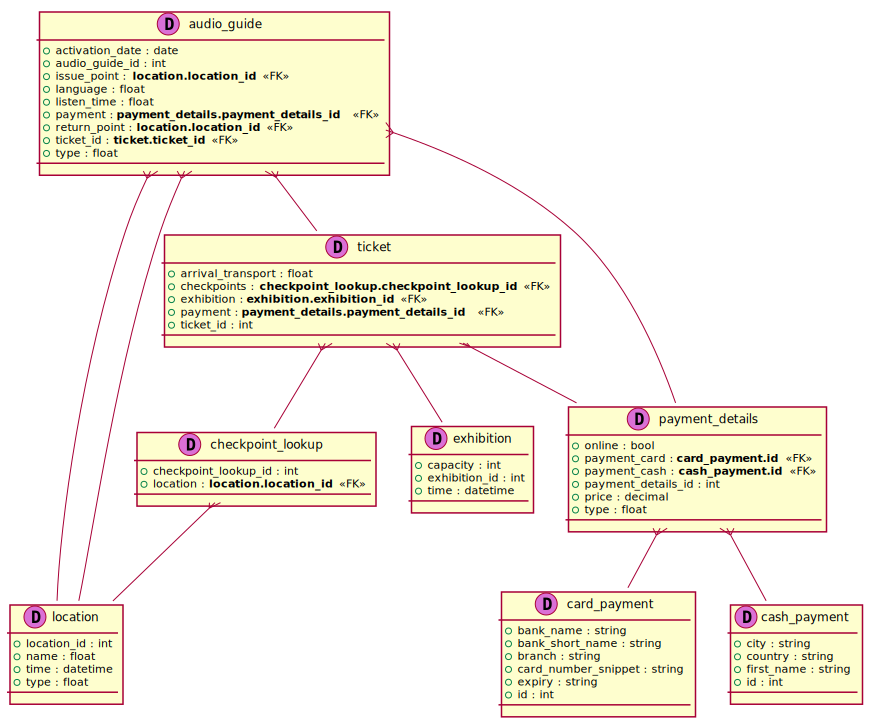

[Back](../README.md)
# Package ServerPackage

## Service Index
| Service Name | Method |
----|----
Server | [Authenticate](#Server-Authenticate) |

## Database Index
| Database Name |
----|
| [RelModel](#Database-RelModel) |

[Types](#Types)

## Integration diagram

---

---

## Server
this is a comment for Server

## Server Authenticate

this is a description of Authenticate

### Sequence Diagram

### Request types

### Response types

---

## Database RelModel

## Types
<table>
<tr>
<th>App Name</th>
<th>Diagram</th>
<th>Comment</th>
<th>Full Link</th>
</tr>
<tr>
<td>MegaDatabase.Empty </td>
<td> </td>
<td>   </td>
<td> [Link](Full-Emptydata-model-Simple0.svg) </td>
</tr>
<td>MegaDatabase.Money </td>
<td> </td>
<td>   </td>
<td> [Link](Full-Moneydata-model-Simple1.svg) </td>
</tr>
<td>Server.Request
</td>
<td> 
</td>
<td>   </td>
<td> 

[Link](Full-Requestdata-model-Simple0.svg)
</td>
</tr>
<td>Server.Response </td>
<td>
  
</td>
<td> 
</td>
<td> [Link](Full-Responsedata-model-Simple1.svg)

</td>
</tr>
</table>
