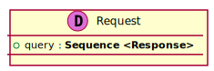

[Back](../README.md)
# Package ServerPackage

## Service Index
| Service Name | Method |
----|----
Server | [Authenticate](#Server-Authenticate) |

## Database Index
| Database Name |
----|
| [RelModel](#Database-RelModel) |

[Types](#Types)

## Integration diagram

---

---

## Server
this is a comment for Server

## Server Authenticate

this is a description of Authenticate

### Sequence Diagram

### Request types

### Response types

---

## Database RelModel

## Types
App Name | Diagram | Comment
----|----|----
MegaDatabase Empty |  | 

Comment
 

MegaDatabase Money |  | 

Comment
 

Server Request |  | 

Comment
 

Server Response |  | 

Comment
 

