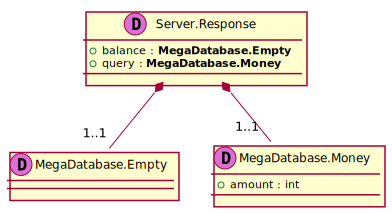

[Back](../README.md)
# Package ServerPackage

## Index
| Service Name | Method |
| - | - | 
| Server | [Authenticate](#Server-Authenticate) |]

---

## Server Authenticate

### Sequence Diagram

### Request types

### Response types

---

