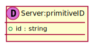
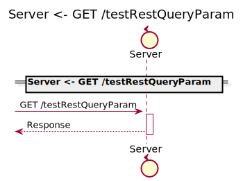
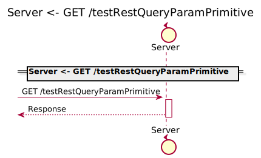
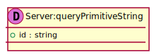
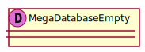

[Back](../README.md)
# Package ServerPackage

## Service Index
| Service Name | Method |
----|----
Server | [Authenticate](#Server-Authenticate) |
Server | [GET/testRestPathParamPrimitive/{primitiveID}](#Server-GET/testRestPathParamPrimitive/{primitiveID}) |
Server | [GET/testRestQueryParam](#Server-GET/testRestQueryParam) |
Server | [GET/testRestQueryParamPrimitive](#Server-GET/testRestQueryParamPrimitive) |
Server | [GET/testRestURLParam/{id}](#Server-GET/testRestURLParam/{id}) |

## Database Index
| Database Name |
----|
| [RelModel](#Database-RelModel) |

[Types](#Types)

## Integration diagram

---

---

## Server

- this is a comment for Server

## Server Authenticate

this is a description of Authenticate

### Sequence Diagram

### Request types

### Response types

## Server GET /testRestPathParamPrimitive/{primitiveID}

### Sequence Diagram

### Request types

### Response types

## Server GET /testRestQueryParam

### Sequence Diagram

### Request types

### Response types

## Server GET /testRestQueryParamPrimitive

### Sequence Diagram

### Request types

### Response types

## Server GET /testRestURLParam/{id}

### Sequence Diagram

### Request types

### Response types

---

## Database RelModel

## Types
<table>
<tr>
<th>App Name</th>
<th>Diagram</th>
<th>Comment</th>
<th>Full Diagram</th>
</tr>

<tr>
<td>

MegaDatabase. Empty
</td>
<td>

</td>
<td> 

 
</td>
<td>

[Link](Full-Emptydata-model1.svg)
</td>
</tr>
<tr>
<td>

MegaDatabase. Money
</td>
<td>

</td>
<td> 

 
</td>
<td>

[Link](Full-Moneydata-model1.svg)
</td>
</tr>
<tr>
<td>

Server. Request
</td>
<td>

</td>
<td> 

 
</td>
<td>

[Link](Full-Requestdata-model1.svg)
</td>
</tr>
<tr>
<td>

Server. Response
</td>
<td>

</td>
<td> 

 
</td>
<td>

[Link](Full-Responsedata-model1.svg)
</td>
</tr>
</table>
