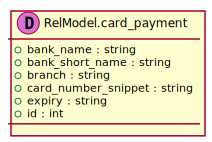
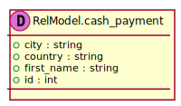
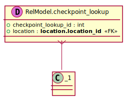

[Back](../README.md)
# Package ServerPackage

## Service Index
| Service Name | Method |
| - | - | 
| Server | [Authenticate](#Server-Authenticate) |

## Database Index
| Database Name |
| - |
| [RelModel](#Database-RelModel) |

## Integration diagram

---

---

## Server
this is a comment for Server

## Server Authenticate

this is a description of Authenticate

### Sequence Diagram

### Request types

### Response types

---

## Database RelModel

## Database 0

## Database 1

## Database 2

## Database 3

## Database 4

## Database 5

## Database 6

## Database 7

## Database 8

## Database 9

## Database 10
this is a comment for Server

## Database 11
this is a comment for Server

