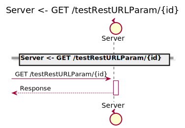
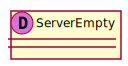

[Back](../README.md)

# ServerPackage

## Service Index
| Service Name | Method |
----|----
Server | [Authenticate](#Server-Authenticate)
Server | [GET /testRestPathParamPrimitive/{primitiveID}](#Server-GETtestRestPathParamPrimitive{primitiveID})
Server | [GET /testRestQueryParam](#Server-GETtestRestQueryParam)
Server | [GET /testRestQueryParamPrimitive](#Server-GETtestRestQueryParamPrimitive)
Server | [GET /testRestURLParam/{id}](#Server-GETtestRestURLParam{id})
Server | [GET /testReturnNil](#Server-GETtestReturnNil)

# MegaDatabase

# RelModel

# Server
this is a comment for Server

## Server Authenticate

### Request types

### Response types

## Server GETtestRestPathParamPrimitive{primitiveID}

### Request types

### Response types

## Server GETtestRestQueryParam

### Request types

### Response types

## Server GETtestRestQueryParamPrimitive

### Request types

### Response types

## Server GETtestRestURLParam{id}

### Request types

### Response types

## Server GETtestReturnNil

### Request types

### Response types

## Database

### Types

<table>
<tr>
<th>App Name</th>
<th>Diagram</th>
<th>Comment</th>
<th>Full Diagram</th>

</tr>

<tr>
<td>

MegaDatabase. Empty
</td>
<td>

</td>
<td> 

 
</td>
<td>

<a href="MegaDatabase/Emptyfull.svg">Link</a>
</td>
</tr>
<tr>
<td>

MegaDatabase. Money
</td>
<td>

</td>
<td> 

 
</td>
<td>

<a href="MegaDatabase/Moneyfull.svg">Link</a>
</td>
</tr>

</tr>

<tr>
<td>

Server. Empty
</td>
<td>

</td>
<td> 

 
</td>
<td>

<a href="Server/Emptyfull.svg">Link</a>
</td>
</tr>
<tr>
<td>

Server. Request
</td>
<td>

</td>
<td> 

 
</td>
<td>

<a href="Server/Requestfull.svg">Link</a>
</td>
</tr>
<tr>
<td>

Server. Response
</td>
<td>

</td>
<td> 

 
</td>
<td>

<a href="Server/Responsefull.svg">Link</a>
</td>
</tr>
</table>

