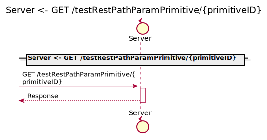
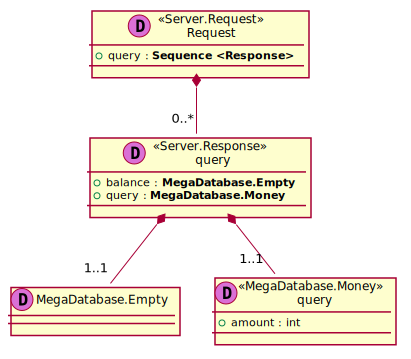
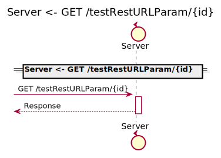
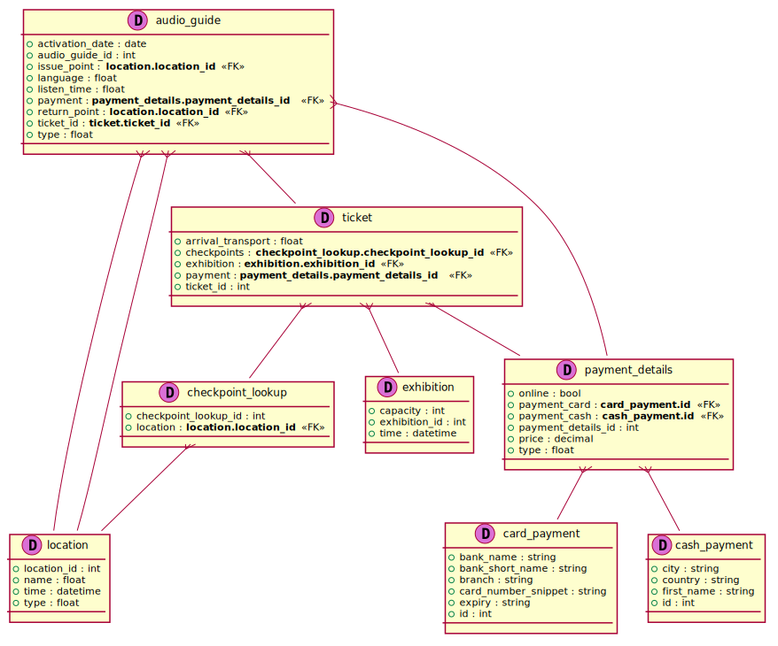

[Back](../README.md)

# ServerPackage

## Service Index
| Service Name | Method | Source Location |
----|----|----
Server | [Authenticate](#Server-Authenticate) | [../../../../demo/simple2.sysl](../../../../demo/simple2.sysl)|  
Server | [GET /testRestPathParamPrimitive/{primitiveID}](#Server-GETtestRestPathParamPrimitive{primitiveID}) | [../../../../demo/simple2.sysl](../../../../demo/simple2.sysl)|  
Server | [GET /testRestQueryParam](#Server-GETtestRestQueryParam) | [../../../../demo/simple2.sysl](../../../../demo/simple2.sysl)|  
Server | [GET /testRestQueryParamPrimitive](#Server-GETtestRestQueryParamPrimitive) | [../../../../demo/simple2.sysl](../../../../demo/simple2.sysl)|  
Server | [GET /testRestURLParam/{id}](#Server-GETtestRestURLParam{id}) | [../../../../demo/simple2.sysl](../../../../demo/simple2.sysl)|  
Server | [GET /testReturnNil](#Server-GETtestReturnNil) | [../../../../demo/simple2.sysl](../../../../demo/simple2.sysl)|  

# RelModel

# Server

this is a comment for Server

## Server Authenticate
this is a description of Authenticate

### Request types

### Response types

No Response Types

## Server GETtestRestPathParamPrimitive{primitiveID}

### Request types

No Request types

### Response types

No Response Types

## Server GETtestRestQueryParam

### Request types

No Request types

### Query Parameter

### Query Parameter

### Response types

No Response Types

## Server GETtestRestQueryParamPrimitive

### Request types

No Request types

### Response types

No Response Types

## Server GETtestRestURLParam{id}

### Request types

No Request types

### Path Parameter

### Response types

No Response Types

## Server GETtestReturnNil

### Request types

No Request types

### Response types

No Response Types

## Database

### Types

<table>
<tr>
<th>App Name</th>
<th>Diagram</th>
<th>Description</th>
<th>Full Diagram</th>

</tr>

<tr>
<td>

Server. Empty
</td>
<td>

</td>
<td> 

Description
 Empty Empty Empty
 
</td>
<td>

<a href="Server/empty.svg">Link</a>
</td>
</tr>
<tr>
<td>

Server. Request
</td>
<td>

</td>
<td> 

Description
 Request Request Request
 
</td>
<td>

<a href="Server/request.svg">Link</a>
</td>
</tr>
<tr>
<td>

Server. Response
</td>
<td>

</td>
<td> 

Description
 Response Response Response
 
</td>
<td>

<a href="Server/response.svg">Link</a>
</td>
</tr>
</table>

