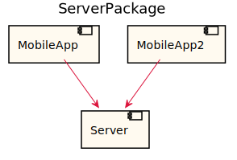
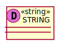
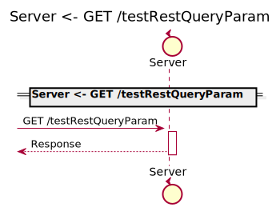
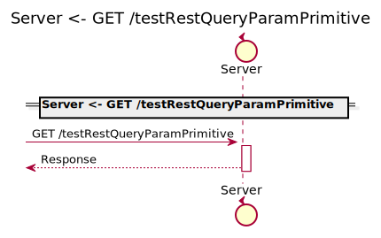
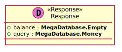

[Back](../README.md) | [Chat with us](https://anzoss.slack.com/messages/sysl-catalog/) | [New bug or feature request](https://github.com/anz-bank/sysl-catalog/issues/new)

# ServerPackage

## Integration Diagram

## Database Index
| Database Application Name  | Source Location |
----|----
[RelModel](#Database-RelModel) | [https:/github.com/anz-bank/sysl-catalog/blob/master/demo/simple2.sysl](https:/github.com/anz-bank/sysl-catalog/blob/master/demo/simple2.sysl)|  

## Application Index
| Application Name | Method | Source Location |
----|----|----
Server | [Authenticate](#Server-Authenticate) | [https:/github.com/anz-bank/sysl-catalog/blob/master/demo/simple2.sysl](https:/github.com/anz-bank/sysl-catalog/blob/master/demo/simple2.sysl)|  
Server | [GET /testRestPathParamPrimitive/{primitiveID}](#Server-GETtestRestPathParamPrimitive{primitiveID}) | [https:/github.com/anz-bank/sysl-catalog/blob/master/demo/simple2.sysl](https:/github.com/anz-bank/sysl-catalog/blob/master/demo/simple2.sysl)|  
Server | [GET /testRestQueryParam](#Server-GETtestRestQueryParam) | [https:/github.com/anz-bank/sysl-catalog/blob/master/demo/simple2.sysl](https:/github.com/anz-bank/sysl-catalog/blob/master/demo/simple2.sysl)|  
Server | [GET /testRestQueryParamPrimitive](#Server-GETtestRestQueryParamPrimitive) | [https:/github.com/anz-bank/sysl-catalog/blob/master/demo/simple2.sysl](https:/github.com/anz-bank/sysl-catalog/blob/master/demo/simple2.sysl)|  
Server | [GET /testRestURLParam/{id}](#Server-GETtestRestURLParam{id}) | [https:/github.com/anz-bank/sysl-catalog/blob/master/demo/simple2.sysl](https:/github.com/anz-bank/sysl-catalog/blob/master/demo/simple2.sysl)|  
Server | [GET /testReturnNil](#Server-GETtestReturnNil) | [https:/github.com/anz-bank/sysl-catalog/blob/master/demo/simple2.sysl](https:/github.com/anz-bank/sysl-catalog/blob/master/demo/simple2.sysl)|  

## Type Index
| Application Name | Type Name | Source Location |
----|----|----
Server | [Empty](#Server.Empty) | [https:/github.com/anz-bank/sysl-catalog/blob/master/demo/simple2.sysl](https:/github.com/anz-bank/sysl-catalog/blob/master/demo/simple2.sysl)|
Server | [Request](#Server.Request) | [https:/github.com/anz-bank/sysl-catalog/blob/master/demo/simple2.sysl](https:/github.com/anz-bank/sysl-catalog/blob/master/demo/simple2.sysl)|
Server | [Response](#Server.Response) | [https:/github.com/anz-bank/sysl-catalog/blob/master/demo/simple2.sysl](https:/github.com/anz-bank/sysl-catalog/blob/master/demo/simple2.sysl)|

# Databases

Database RelModel

# Applications

## Application Server

- this is a comment for Server

### Server Authenticate
this is a description of Authenticate

Sequence Diagram

Request types

#### Request types

Response types

#### Response types

---

### Server GET /testRestPathParamPrimitive/{primitiveID}

Sequence Diagram

Request types

#### Request types

#### Path Parameter

Response types

#### Response types

---

### Server GET /testRestQueryParam

Sequence Diagram

Request types

#### Request types

#### Query Parameter

#### Query Parameter

Response types

#### Response types

---

### Server GET /testRestQueryParamPrimitive

Sequence Diagram

Request types

#### Request types

#### Query Parameter

Response types

#### Response types

---

### Server GET /testRestURLParam/{id}

Sequence Diagram

Request types

#### Request types

#### Path Parameter

Response types

#### Response types

---

### Server GET /testReturnNil

Sequence Diagram

Request types

#### Request types

Response types

#### Response types

No Response Types

---

# Types

Server.Empty

### Server.Empty

- Empty Empty Empty

[Full Diagram](Server/empty.svg)

#### Fields

| Field name | Type | Description |
|----|----|----|

Server.Request

### Server.Request

- Request Request Request

[Full Diagram](Server/request.svg)

#### Fields

| Field name | Type | Description |
|----|----|----|
| query | sequence of Response | |

Server.Response

### Server.Response

- Response Response Response

[Full Diagram](Server/response.svg)

#### Fields

| Field name | Type | Description |
|----|----|----|
| balance | MegaDatabase.Empty | |
| query | MegaDatabase.Money | |

