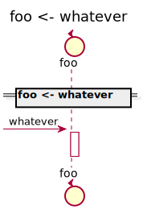
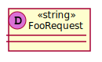

[Back](../README.md) | [Chat with us](https://anzoss.slack.com/messages/sysl-catalog/) | [New bug or feature request](https://github.com/anz-bank/sysl-catalog/issues/new)

# foo

## Integration Diagram

## Application Index

| Application Name | Method | Source Location |
|----|----|----|
| foo | [whatever](#foo-whatever) | [https://github.com/anz-bank/sysl-catalog/blob/master/demo/simple2.sysl](https://github.com/anz-bank/sysl-catalog/blob/master/demo/simple2.sysl)|  

## Type Index

| Application Name | Type Name | Source Location |
|----|----|----|
| foo | [FooRequest](#foo.FooRequest) | [https://github.com/anz-bank/sysl-catalog/blob/master/demo/simple2.sysl](https://github.com/anz-bank/sysl-catalog/blob/master/demo/simple2.sysl)|

# Applications

## Application foo

### foo whatever

Sequence Diagram

Request types

No Request types

Response types

No Response Types

---

# Types

foo.FooRequest

### foo.FooRequest

[Full Diagram](foo/foorequest.svg)

