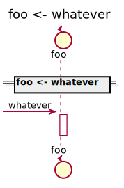

[Back](../README.md) | [Chat with us]() | [New bug or feature request]()

# foo

## Integration Diagram

## Application Index
| Application Name | Method | Source Location |
----|----|----
foo | [whatever](#foo-whatever) | [https:/github.com/anz-bank/sysl-catalog/blob/master/demo/simple2.sysl](https:/github.com/anz-bank/sysl-catalog/blob/master/demo/simple2.sysl)|  

## Type Index
| Application Name | Type Name | Source Location |
----|----|----

# Applications

## Application foo

- 

### foo whatever

Sequence Diagram

Request types

#### Request types

No Request types

Response types

#### Response types

No Response Types

---

# Types

