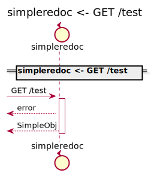
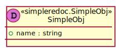
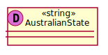
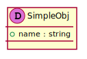
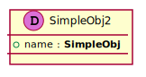

[Back](../README.md) | [Chat with us](https://anzoss.slack.com/messages/sysl-catalog/) | [New bug or feature request](https://github.com/anz-bank/sysl-catalog/issues/new)

# simpleredoc

## Integration Diagram

## Application Index

| Application Name | Method | Source Location |
|----|----|----|
| simpleredoc | [GET /test](#simpleredoc-GETtest) | [https://github.com/anz-bank/sysl-catalog/blob/master/demo/simple.yaml](https://github.com/anz-bank/sysl-catalog/blob/master/demo/simple.yaml)|  

## Type Index

| Application Name | Type Name | Source Location |
|----|----|----|
| simpleredoc | [AustralianState](#simpleredoc.AustralianState) | [https://github.com/anz-bank/sysl-catalog/blob/master/demo/simple.yaml](https://github.com/anz-bank/sysl-catalog/blob/master/demo/simple.yaml)|
| simpleredoc | [SimpleObj](#simpleredoc.SimpleObj) | [https://github.com/anz-bank/sysl-catalog/blob/master/demo/simple.yaml](https://github.com/anz-bank/sysl-catalog/blob/master/demo/simple.yaml)|
| simpleredoc | [SimpleObj2](#simpleredoc.SimpleObj2) | [https://github.com/anz-bank/sysl-catalog/blob/master/demo/simple.yaml](https://github.com/anz-bank/sysl-catalog/blob/master/demo/simple.yaml)|

# Applications

## Application simpleredoc

- No description.

### simpleredoc GET /test

Sequence Diagram

Request types

No Request types

Response types

---

# Types

simpleredoc.AustralianState

### simpleredoc.AustralianState

[Full Diagram](simpleredoc/australianstate.svg)

simpleredoc.SimpleObj

### simpleredoc.SimpleObj

[Full Diagram](simpleredoc/simpleobj.svg)

#### Fields

| Field name | Type | Description |
|----|----|----|
| name | string | |

simpleredoc.SimpleObj2

### simpleredoc.SimpleObj2

[Full Diagram](simpleredoc/simpleobj2.svg)

#### Fields

| Field name | Type | Description |
|----|----|----|
| name | SimpleObj | |

