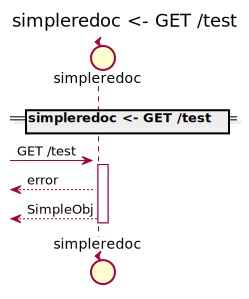
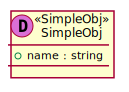
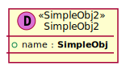

[Back](../README.md)

# simpleredoc

## Integration Diagram

## Application Index
| Application Name | Method | Source Location |
----|----|----
simpleredoc | [GET /test](#simpleredoc-GETtest) | [../../../../demo/simple.yaml](../../../../demo/simple.yaml)|  

## Type Index
| Application Name | Type Name | Source Location |
----|----|----
simpleredoc | [SimpleObj](#simpleredoc.SimpleObj) | [../../../../demo/simple.yaml](../../../../demo/simple.yaml)|
simpleredoc | [SimpleObj2](#simpleredoc.SimpleObj2) | [../../../../demo/simple.yaml](../../../../demo/simple.yaml)|

# Applications

## Application simpleredoc

- No description.

### simpleredoc GETtest

Sequence Diagram

Request types

#### Request types

Response types

#### Response types

---

# Types

simpleredoc.SimpleObj

### simpleredoc.SimpleObj

- 

[Full Diagram](simpleredoc/simpleobj.svg)

#### Fields

| Field name | Type | Description |
|----|----|----|
| name | string | |

simpleredoc.SimpleObj2

### simpleredoc.SimpleObj2

- 

[Full Diagram](simpleredoc/simpleobj2.svg)

#### Fields

| Field name | Type | Description |
|----|----|----|
| name | SimpleObj | |

