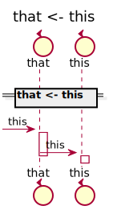

[Back](../README.md)

# that

## Integration Diagram

## Application Index
| Application Name | Method | Source Location |
----|----|----
that | [this](#that-this) | [../../../demo/simple2.sysl](../../../demo/simple2.sysl)|  

## Type Index
| Application Name | Type Name | Source Location |
----|----|----

# Applications

## Application that

- 

### that this

Sequence Diagram

Request types

#### Request types

No Request types

Response types

#### Response types

No Response Types

---

# Types

