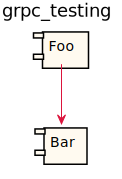
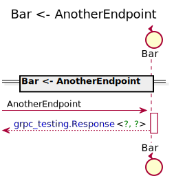
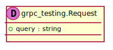
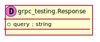
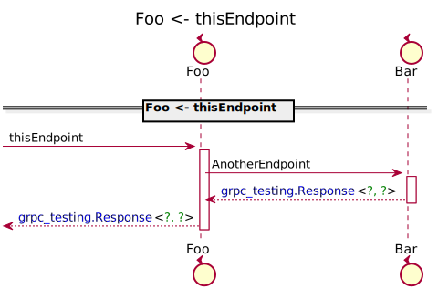
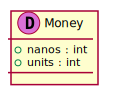
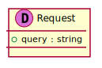
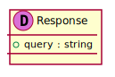

[Back](../README.md)

# grpc_testing

## Integration Diagram

## Application Index
| Application Name | Method | Source Location |
----|----|----
Bar | [AnotherEndpoint](#Bar-AnotherEndpoint) | [../../simple.proto](../../simple.proto)|  
Foo | [thisEndpoint](#Foo-thisEndpoint) | [../../simple.proto](../../simple.proto)|  

## Type Index
| Application Name | Type Name | Source Location |
----|----|----
grpc_testing | [Money](#grpc_testing.Money) | [../../simple.proto](../../simple.proto)|
grpc_testing | [Request](#grpc_testing.Request) | [../../simple.proto](../../simple.proto)|
grpc_testing | [Response](#grpc_testing.Response) | [../../simple.proto](../../simple.proto)|

# Applications

## Application Bar

- This is a comment before Bar

### Bar AnotherEndpoint
this is a comment before Bar.AnotherEndpoint

Sequence Diagram

Request types

#### Request types

Response types

#### Response types

---

## Application Foo

- This is a comment before Foo

### Foo thisEndpoint

Sequence Diagram

Request types

#### Request types

Response types

#### Response types

---

# Types

grpc_testing.Money

### grpc_testing.Money

- 

[Full Diagram](../../docs/images/grpc_testing-grpc_testing-money.svg)

#### Fields

| Field name | Type | Description |
|----|----|----|
| nanos | int | |
| units | int | |

grpc_testing.Request

### grpc_testing.Request

- 

[Full Diagram](../../docs/images/grpc_testing-grpc_testing-request.svg)

#### Fields

| Field name | Type | Description |
|----|----|----|
| query | string | |

grpc_testing.Response

### grpc_testing.Response

- 

[Full Diagram](../../docs/images/grpc_testing-grpc_testing-response.svg)

#### Fields

| Field name | Type | Description |
|----|----|----|
| query | string | |

