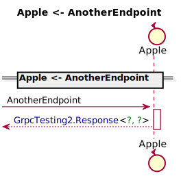
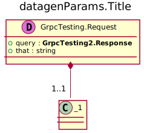
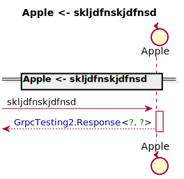
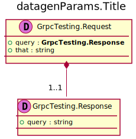
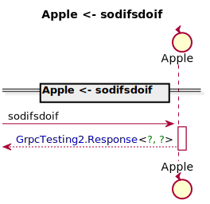
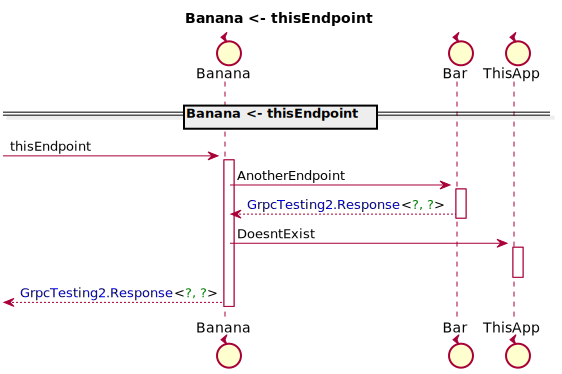

[Back](../README.md)
# Package Fruits

## Index
| AppName | Endpoint |
| - | - | 
| Apple | [AnotherEndpoint](#Apple_AnotherEndpoint) |
| Apple | [skljdfnskjdfnsd](#Apple_skljdfnskjdfnsd) |
| Apple | [sodifsdoif](#Apple_sodifsdoif) |
| Banana | [thisEndpoint](#Banana_thisEndpoint) |]

## Apple AnotherEndpoint

### Parameter types

### Sequence Diagram

## Apple skljdfnskjdfnsd

### Parameter types

### Sequence Diagram

## Apple sodifsdoif

### Parameter types

### Sequence Diagram

## Banana thisEndpoint

### Parameter types

### Sequence Diagram

