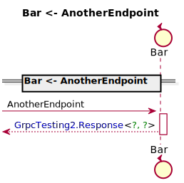

[Back](../README.md)
# Package Standard

## Index
| AppName | Endpoint |
| - | - | 
| Bar | [AnotherEndpoint](#Bar_AnotherEndpoint) |
| Foo | [thisEndpoint](#Foo_thisEndpoint) |]

## Bar AnotherEndpoint

### Parameter types

### Sequence Diagram

## Foo thisEndpoint

### Parameter types

### Sequence Diagram

