[Back](../README.md)

# ServerPackage

## Integration Diagram
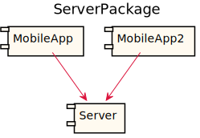

## Database Index
| Database Application Name  | Source Location |
----|----
[RelModel](#Database-RelModel) | [../../../demo/simple2.sysl](../../../demo/simple2.sysl)|  

## Application Index
| Application Name | Method | Source Location |
----|----|----
Server | [Authenticate](#Server-Authenticate) | [../../../demo/simple2.sysl](../../../demo/simple2.sysl)|  
Server | [GET /testRestPathParamPrimitive/{primitiveID}](#Server-GETtestRestPathParamPrimitive{primitiveID}) | [../../../demo/simple2.sysl](../../../demo/simple2.sysl)|  
Server | [GET /testRestQueryParam](#Server-GETtestRestQueryParam) | [../../../demo/simple2.sysl](../../../demo/simple2.sysl)|  
Server | [GET /testRestQueryParamPrimitive](#Server-GETtestRestQueryParamPrimitive) | [../../../demo/simple2.sysl](../../../demo/simple2.sysl)|  
Server | [GET /testRestURLParam/{id}](#Server-GETtestRestURLParam{id}) | [../../../demo/simple2.sysl](../../../demo/simple2.sysl)|  
Server | [GET /testReturnNil](#Server-GETtestReturnNil) | [../../../demo/simple2.sysl](../../../demo/simple2.sysl)|  

## Type Index
| Application Name | Type Name | Source Location |
----|----|----
Server | [Empty](#Server.Empty) | [../../../demo/simple2.sysl](../../../demo/simple2.sysl)|
Server | [Request](#Server.Request) | [../../../demo/simple2.sysl](../../../demo/simple2.sysl)|
Server | [Response](#Server.Response) | [../../../demo/simple2.sysl](../../../demo/simple2.sysl)|

# Databases

Database RelModel

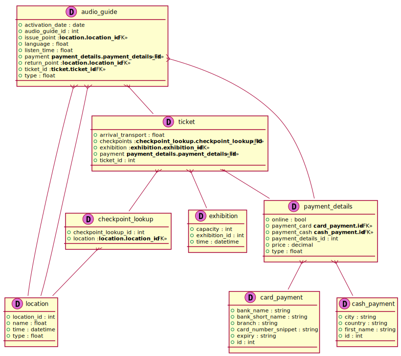

# Applications

## Application Server

- this is a comment for Server

### Server Authenticate
this is a description of Authenticate

Sequence Diagram

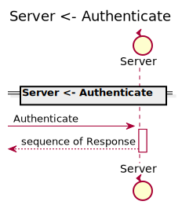

Request types

#### Request types

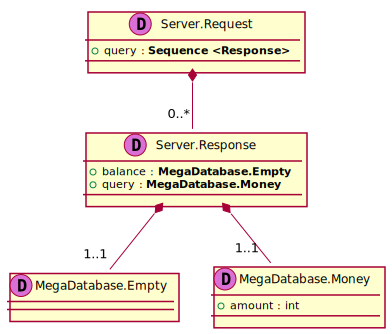

Response types

#### Response types

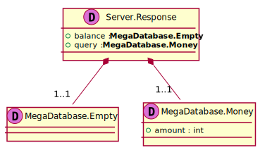

---

### Server GETtestRestPathParamPrimitive{primitiveID}

Sequence Diagram

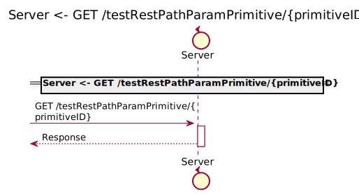

Request types

#### Request types

#### Path Parameter

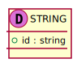

Response types

#### Response types

---

### Server GETtestRestQueryParam

Sequence Diagram

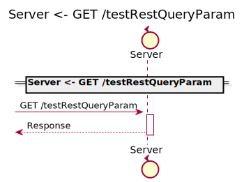

Request types

#### Request types

#### Query Parameter

#### Query Parameter

Response types

#### Response types

---

### Server GETtestRestQueryParamPrimitive

Sequence Diagram

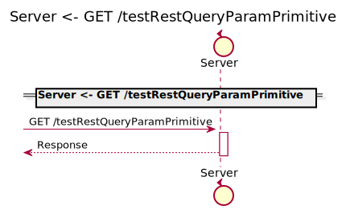

Request types

#### Request types

#### Query Parameter

Response types

#### Response types

---

### Server GETtestRestURLParam{id}

Sequence Diagram

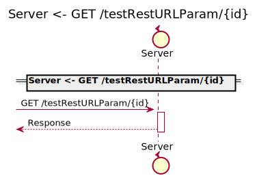

Request types

#### Request types

#### Path Parameter

Response types

#### Response types

---

### Server GETtestReturnNil

Sequence Diagram

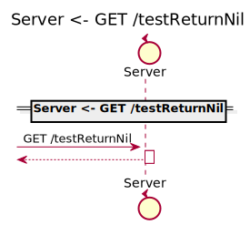

Request types

#### Request types

Response types

#### Response types

No Response Types

---

# Types

Server.Empty

### Server.Empty

- Empty Empty Empty

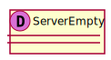

[Full Diagram](Server/empty.svg)

#### Fields

| Field name | Type | Description |
|----|----|----|

Server.Request

### Server.Request

- Request Request Request

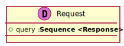

[Full Diagram](Server/request.svg)

#### Fields

| Field name | Type | Description |
|----|----|----|
| query | sequence of Response | |

Server.Response

### Server.Response

- Response Response Response

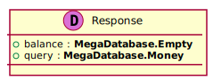

[Full Diagram](Server/response.svg)

#### Fields

| Field name | Type | Description |
|----|----|----|
| balance | MegaDatabase.Empty | |
| query | MegaDatabase.Money | |

